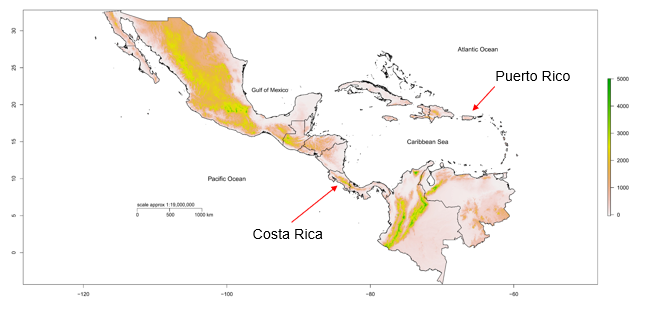
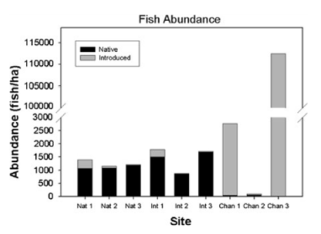
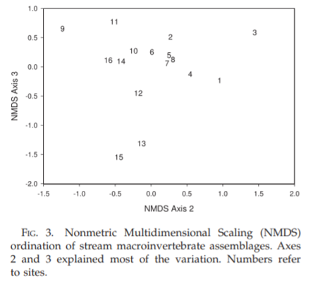

```{r, echo=FALSE, message=FALSE, warning=FALSE}
library(readxl)
library(readr)
library(lessR)
library(ggplot2)
library(patchwork)
library(palmerpenguins)
library(car)
library(ggforce) # for geom_circle
library(RVAideMemoire) #shapiro.test
library(DiagrammeR)
knitr::opts_chunk$set(dpi= 300)
xaringanExtra::use_panelset()
xaringanExtra::use_scribble()
xaringanExtra::use_search(show_icon = TRUE, auto_search	=FALSE, position= "bottom-left") # Search
xaringanExtra::use_progress_bar(color = "#0051BA", location = "bottom", 
                                height = "4px")
xaringanExtra::use_clipboard() # Copy Code 
xaringanExtra::use_extra_styles(
  hover_code_line = TRUE,         #<<
  mute_unhighlighted_code = TRUE  #<<
)
xaringanExtra::use_editable(expires = 1) # Add textboxes to edit during presentation
```

# Outline

- About me

- Extreme climate events
    - Hurricanes
    - Droughts
    
- Urban stream syndrome

---
# About me
.pull-left[
- I grew up in Turrialba, CR
]
.pull-right[ 
]


---
# About me
.pull-left[
- I grew up in Turrialba, CR

- University of Costa Rica
    - BS in biology
    - MSc in aquatic science
    
]
.pull-right[ 
]


---
# About me
.pull-left[
- I grew up in Turrialba, CR

- University of Costa Rica
    - BS in biology
    - MSc in aquatic science

- University of Puerto Rico
    - PhD in community ecology
    - Postdoc in ecosystem ecology and disturbance ecology 

]
.pull-right[ 
]

---
# Puerto Rico context
- Puerto Rico is an archipelago located between the Atlantic Ocean and the Caribbean Sea. It is the smallest island of the greater Antilles.

.center[

]

---
# Puerto Rico context
.pull-left[
- Most people live in San Juan Metropolitan area

- 62% of PR is forested 
]

.pull-right[ 
.center[

]]

---
# International Decade of Natural Disaster Reduction (1990s)
.pull-left[
- Storm, .red[**hurricanes**], floods, landslides, wildfires, .red[**drought**], desertification, treefalls, exotic invasions, earthquakes

]

.pull-right[ 

]

---
# International Decade of Natural Disaster Reduction (1990s)
.pull-left[
- Storm, .red[**hurricanes**], floods, landslides, wildfires, .red[**drought**], desertification, treefalls, exotic invasions, earthquakes

- .red[**Urbanization**]

]

.pull-right[ 

]

---
# Hurricane disturbances
.pull-left[
- Hurricanes are important natural disturbances in Puerto Rico

- Its location makes the island vulnerable to the impact of hurricanes
]

.pull-right[ 

]

---
# Urban stream syndrome
.pull-left[
The term **urban stream syndrome** describes the physical and ecological response of streams to catchment urbanization (Walsh et al. 2005).

- a flashy hydrograph (flash floods, quick pulses of water in creeks).
- high concentrations of nutrients and contaminants.
- altered channel morphology and stability.
- reduced biotic richness, with increased dominance of invasive tolerant species.
]

.pull-right[
.center[

]]


---
# Urban stream syndrome
.pull-left[
1. Fish assemblages
2. Macroinvertebrate assemblages
3. Flow regime
4. Riparian zone
5. Ecosystem function
6. Physicochemistry
]

.pull-right[
.center[

]]

---
# Urban stream syndrome
.pull-left[
1. Fish assemblages
2. Macroinvertebrate assemblages
3. Flow regime
4. Riparian zone
5. Ecosystem function
6. Physicochemistry
]

.pull-right[
.center[


]]

---
# Urban stream syndrome
.pull-left[
1. .red[**Fish assemblages**]
2. Macroinvertebrate assemblages
3. Flow regime
4. Riparian zone
5. Ecosystem function
6. Physicochemistry
]

.pull-right[
.center[


]]


---
# Urban stream syndrome
.pull-left[

.center[

]]

.pull-right[
.center[


<br>


]]

---
# Urban stream syndrome
.pull-left[

.center[

]]

.pull-right[
.center[
**Native**<br>


**Introduce**<br>

]]


---
# Urban stream syndrome
.pull-left[
]

.pull-right[
.center[


]]

---
# Urban stream syndrome
.pull-left[
1. Fish assemblages
2. .red[**Macroinvertebrate assemblages**]
3. Flow regime
4. Riparian zone
5. Ecosystem function
6. Physicochemistry
]

.pull-right[
.center[


]]


---
# Urban stream syndrome
.pull-left[

]

.pull-right[
.center[


]]

---
# Urban stream syndrome
.pull-left[
]

.pull-right[
.center[

]]

---
# Urban stream syndrome
.pull-left[
1. Fish assemblages
2. Macroinvertebrate assemblages
3. Flow regime
4. Riparian zone
5. .red[**Ecosystem function**]
6. Physicochemistry
]

.pull-right[
.center[


]]

---
# Urban stream syndrome
.pull-left[
.center[

]]

.pull-right[
.center[


]]

---
# Urban stream syndrome
.pull-left[
.center[

]]

.pull-right[
.center[


]]


---
# Urban stream syndrome
.pull-left[
1. Fish assemblages
2. Macroinvertebrate assemblages
3. Flow regime
4. Riparian zone
5. Ecosystem function
6. .red[**Physicochemistry**]
]

.pull-right[
.center[


]]

---
# Urban stream syndrome
.pull-left[
.center[

]]

.pull-right[
.center[

]]

---
# Urban stream syndrome
.pull-left[
.center[

]]

.pull-right[
.center[

]]

