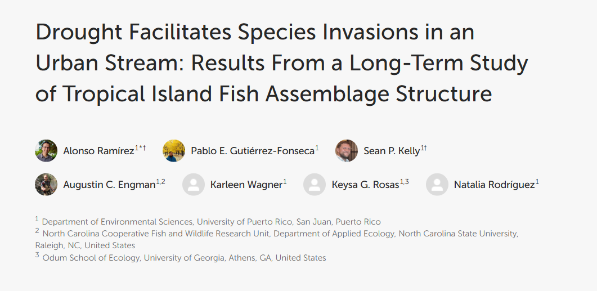
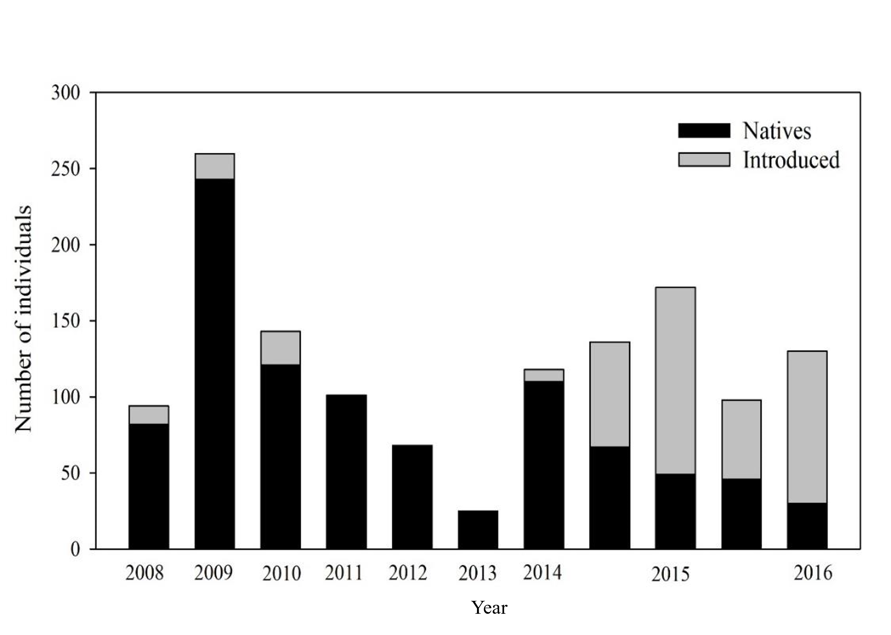

<link href="https://cdnjs.cloudflare.com/ajax/libs/font-awesome/5.15.4/css/all.min.css" rel="stylesheet">

```{r, echo=FALSE, message=FALSE, warning=FALSE}
library(readxl)
library(readr)
library(lessR)
library(ggplot2)
library(patchwork)
library(palmerpenguins)
library(car)
library(ggforce) # for geom_circle
library(RVAideMemoire) #shapiro.test
library(DiagrammeR)
knitr::opts_chunk$set(dpi= 300)
xaringanExtra::use_panelset()
xaringanExtra::use_scribble()
xaringanExtra::use_search(show_icon = FALSE, auto_search	=FALSE, position= "bottom-left") # Search
xaringanExtra::use_progress_bar(color = "#0051BA", location = "bottom", 
                                height = "4px")
xaringanExtra::use_clipboard() # Copy Code 
xaringanExtra::use_extra_styles(
  hover_code_line = TRUE,         #<<
  mute_unhighlighted_code = TRUE  #<<
)
xaringanExtra::use_editable(expires = 1) # Add textboxes to edit during presentation
```


# Outline

- About me

- Extreme climate events
    - Hurricanes
    - Droughts
    
- Urban stream syndrome
    - Rio Piedras, Puerto Rico

---
# About me
.pull-left[
- I grew up in Turrialba, CR
]
.pull-right[ 
.center[

]
]


---
# About me
.pull-left[
- I grew up in Turrialba, CR

- University of Costa Rica
    - BS in biology
    - MSc in aquatic science
    
]
.pull-right[ 
.center[

]
]


---
# About me
.pull-left[
- I grew up in Turrialba, CR

- University of Costa Rica
    - BS in biology
    - MSc in aquatic science

- University of Puerto Rico
    - PhD in community ecology
    - Postdoc in ecosystem ecology and disturbance ecology

]
.pull-right[ 
.center[

]
]


---
# About me
.pull-left[
- I grew up in Turrialba, CR

- University of Costa Rica
    - BS in biology
    - MSc in aquatic science

- University of Puerto Rico
    - PhD in community ecology
    - Postdoc in ecosystem ecology and disturbance ecology
    
- Passionate about understanding how ecosystems respond to change and working with others to advance ecological research.

]
.pull-right[ 
.center[

]
]

---
# Puerto Rico context
- Puerto Rico is an archipelago located between the Atlantic Ocean and the Caribbean Sea. 
<br>

- It is the smallest island of the greater Antilles.

.center-middle[

]

---
# Puerto Rico context
.pull-left[
- Most people live in the San Juan Metropolitan Area, which is the economic and cultural hub of Puerto Rico.

- 62% of Puerto Rico is forested, showcasing a remarkable balance between urbanization and natural ecosystems.

]

.pull-right[ 
.center[

]]

---
# International Decade of Natural Disaster Reduction (1990s)
.pull-left[
- Storm, .red[**hurricanes**], floods, landslides, wildfires, .red[**drought**], desertification, treefalls, exotic invasions, earthquakes.

]

.pull-right[ 
.center[

]
]

---
# International Decade of Natural Disaster Reduction (1990s)
.pull-left[
- Storm, .red[**hurricanes**], floods, landslides, wildfires, .red[**drought**], desertification, treefalls, exotic invasions, earthquakes.

- .red[**Urbanization**]

]

.pull-right[ 
.center[

]
]


---
# Hurricane disturbances

---
# Hurricane disturbances
.pull-left[
- Hurricanes are critical natural disturbances in shaping Puerto Rico's ecosystems.

- Puerto Rico's geographic location in the Caribbean makes it highly vulnerable to frequent and intense hurricanes.

- These disturbances affect both natural landscapes (forests, streams) and human communities.
]

.pull-right[ 

]

---
# Hurricane disturbances
.pull-left[
- Hurricanes strike Puerto Rico on average every ~22 years.

- In the Luquillo Experimental Forest, hurricanes occur approximately every ~42 years.
]

.pull-right[ 

]

---
# Hurricane disturbances
.pull-left[
- In September 2017, Puerto Rico was impacted by two hurricanes: Irma and Maria.  

]

.pull-right[ 
Hurricane Irma 
.center[]
Hurricane Maria
.center[]
]

---
# Puerto Rico and Droughts 

---
# Puerto Rico and Droughts 
.pull-left[
- Every 10 to 20 years, consecutive dry days cause small headwater streams to dry up completely.

- This periodic drying limits aquatic habitats, creating challenges for stream-dwelling organisms.]

.pull-right[ 
.center[]
.center[]
]

.footnote[Scatena et al (2012), Gutiérrez-Fonseca et al. (2020)]

---
# Puerto Rico and Droughts 
.pull-left[
.center-middle[]]

.pull-right[ 
.center[]
.center[]
]

.footnote[Scatena et al (2012), Gutiérrez-Fonseca et al. (2020)]


---
# Puerto Rico and Droughts 
.pull-left[

.center-middle[
]]

.pull-right[ 
.center[]
.center[]
]

.footnote[Herrera and Ault (2017)]


---
# Puerto Rico and Droughts 
.pull-left[
- **Potamodromous:** fishes move within the freshwater environment, typically in a river or stream system. 
.center-middle[
]]

.pull-right[ 
- **Diadromous:** fishes move between freshwater and saltwater environments at some point in its life cycle.
.center[
]]

---
# Puerto Rico and Droughts 
.pull-left[
- We assessed long-term patterns in fish assemblages (2008–2016) in an urban stream in San Juan, Puerto Rico. 

- We hypothesized that drought periods would result in negative effects on native fish species and positive effects on introduced species.
]

.pull-right[ 
.center[]
.center[]
]

.footnote[Ramirez et al (2018)]
---
# Puerto Rico and Droughts 
.pull-left[
- Native fish were dominant (2008-2014)
.center[]

- Introduced fish were dominant (2015 - 2016)
.center[]

]

.pull-right[ 
.center[]
.center[]
]


---
# Puerto Rico and Droughts 
.pull-left[
- Native fish were dominant (2008-2014)
.center[]

- Introduced fish were dominant (2015 - 2016)
.center[]

]

.pull-right[ 
.center-middle[]
]


---
# Puerto Rico and Droughts 
.pull-left[
- Native fish were dominant (2008-2014)
.center[]

- Introduced fish were dominant (2015 - 2016)
.center[]

]

.pull-right[ 
.center[]
.center[]
]

---
# Hurricanes vs. Droughts

---
# Hurricanes vs. Droughts
Both are major disturbances

- Drought
    - Major negative impact by allowing the establishment of introduced species.  

- Hurricanes
    - Negative impacts, but similar to major flooding.


---
# Urban stream syndrome

---
# Urban stream syndrome
.pull-left[
The term **urban stream syndrome** describes the physical and ecological response of streams to catchment urbanization (Walsh et al. 2005).

- a flashy hydrograph (flash floods, quick pulses of water in creeks).
- high concentrations of nutrients and contaminants.
- altered channel morphology and stability.
- reduced biotic richness, with increased dominance of invasive tolerant species.
]

.pull-right[
.center[

]]


---
# Urban stream syndrome
.pull-left[
1. Fish assemblages
2. Macroinvertebrate assemblages
3. Flow regime
4. Riparian zone
5. Ecosystem function
6. Physicochemistry
]

.pull-right[
.center[

]]

---
# Urban stream syndrome
.pull-left[
1. Fish assemblages
2. Macroinvertebrate assemblages
3. Flow regime
4. Riparian zone
5. Ecosystem function
6. Physicochemistry
]

.pull-right[
.center[


]]

---
# Urban stream syndrome
.pull-left[
1. .red[**Fish assemblages**]
2. Macroinvertebrate assemblages
3. Flow regime
4. Riparian zone
5. Ecosystem function
6. Physicochemistry
]

.pull-right[
.center[


]]


---
# Urban stream syndrome
.pull-left[

.center[

]]

.pull-right[
.center[


<br>


]]

---
# Urban stream syndrome
.pull-left[

.center[

]]

.pull-right[
- **Native**<br>
.center[]

- **Introduced**<br>
.center[]
]


---
# Urban stream syndrome
.pull-left[
]

.pull-right[
.center[


]]

---
# Urban stream syndrome
.pull-left[
1. Fish assemblages
2. .red[**Macroinvertebrate assemblages**]
3. Flow regime
4. Riparian zone
5. Ecosystem function
6. Physicochemistry
]

.pull-right[
.center[


]]


---
# Urban stream syndrome
.pull-left[

]

.pull-right[
.center[


]]

---
# Urban stream syndrome
.pull-left[
]

.pull-right[
.center[

]]

---
# Urban stream syndrome
.pull-left[
1. Fish assemblages
2. Macroinvertebrate assemblages
3. Flow regime
4. Riparian zone
5. .red[**Ecosystem function**]
6. Physicochemistry
]

.pull-right[
.center[


]]

---
# Urban stream syndrome
.pull-left[
.center[

]]

.pull-right[
.center[


]]

---
# Urban stream syndrome
.pull-left[
.center[

]]

.pull-right[
.center[


]]


---
# Urban stream syndrome
.pull-left[
1. Fish assemblages
2. Macroinvertebrate assemblages
3. Flow regime
4. Riparian zone
5. Ecosystem function
6. .red[**Physicochemistry**]
]

.pull-right[
.center[


]]

---
# Urban stream syndrome
.pull-left[
.center[

]]

.pull-right[
.center[

]]

---
# Urban stream syndrome
.pull-left[
.center[

]]

.pull-right[
.center[

]]

---
# Urban streams are: 
- Functional ecosystems
    - Native fauna present

- Key factors
    - Flow alteration
    - Altered geomorphology 
    - Movement barriers
    - High solute levels

